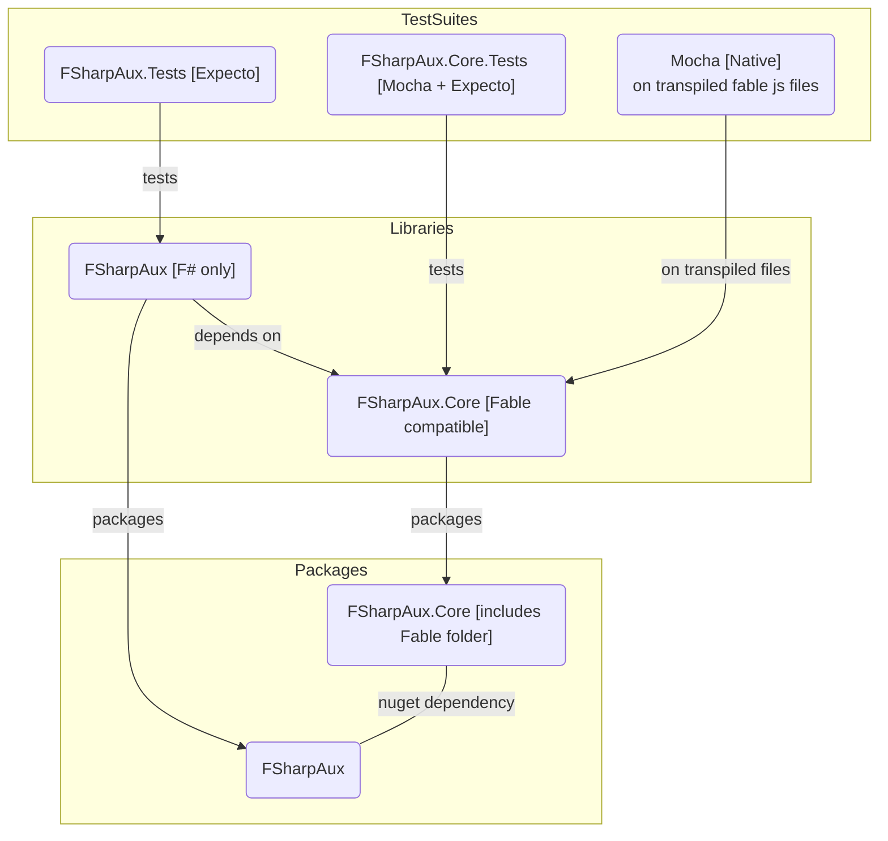

# FSharpAux	# FSharpAux

Extensions, auxiliary functions and data structures for the F# programming language

## Documentation	

The documentation can be found [here.](http://csbiology.github.io/FSharpAux)	

The documentation for this library is automatically generated (using the F# Formatting) from *.fsx and *.md files in the docs folder. If you find a typo, please submit a pull request!

## Develop

### ProjectDescription

### Requirements

- .Net 6.0
- node.js ~16 (higher might work) [only for fable testing]
- npm ~8 (higher might work) [only for fable testing]

### Setup

1. `dotnet tool restore`
1. `npm install`

### Build Tasks

Build tasks are contained in ./build/build.fsproj.

To build the project, run either `./build.cmd` or `./build.sh`

To pass build targets: `./build.cmd <tagetName>` or `./build.sh <tagetName>`

#### Tests

- You can run all tests with `./build.cmd watchtests` in watch mode.
- Or you can run the tests once with `./build.cmd runtests`.
- `build/TestTaks.fs` contains more buildtarget to test specific cases.

